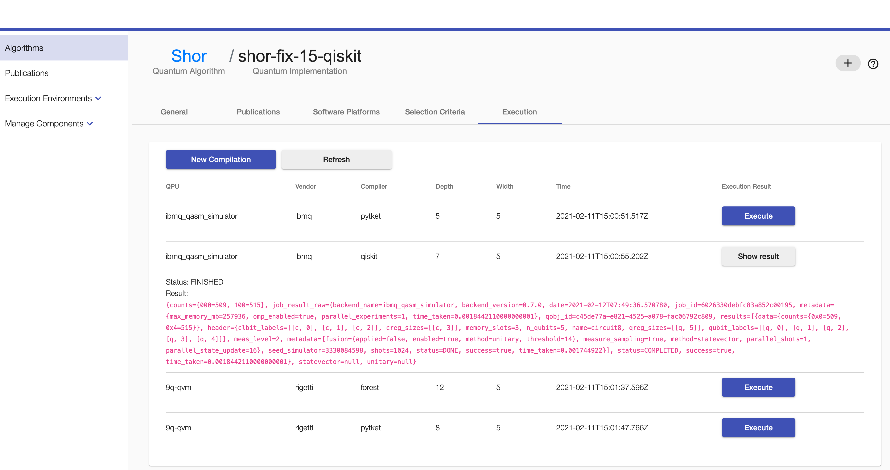

# compiler-selection

This repository contains the docker-compose and sample circuits for the compilation of a certain quantum circuit for several quantum compilers supporting the selection of the most suitable compiled circuit and execute it.

A demo video can be viewed here [here](https://youtu.be/I5l8vaA-zO8).

## Dockerized compiler-selection

Docker Compose file for running the entire compiler-selection environment.

The fastest way to get started is using [Docker Compose](https://docs.docker.com/compose/):

  ```shell
  docker-compose pull
  docker-compose up
  ```

| compiler-selection Component | URL | GitHub | Docker Hub |
|:------------------- |:--- |:------ |:---------- |
| QC-Atlas |<http://localhost:8080/atlas> | [Link](https://github.com/UST-QuAntiL/qc-atlas) | [Link](https://hub.docker.com/r/planqk/atlas) |
| Postgres-Multi DB | <localhost:5432> | [Link](https://github.com/lmm-git/docker-postgres-multi) | [Link](https://hub.docker.com/r/lmmdock/postgres-multi) |
| QC-Atlas-UI |<http://localhost:80> | [Link](https://github.com/UST-QuAntiL/qc-atlas-ui) | [Link](https://hub.docker.com/r/planqk/qc-atlas-ui) |
| NISQ-Analyzer |<http://localhost:8081/nisq-analyzer> | [Link](https://github.com/UST-QuAntiL/nisq-analyzer) | [Link](https://hub.docker.com/r/planqk/nisq-analyzer) |
| Qiskit-Service |<http://localhost:5003> | [Link](https://github.com/UST-QuAntiL/qiskit-service) | [Link](https://hub.docker.com/r/planqk/qiskit-service) |
| Forest-Service |<http://localhost:5002> | [Link](https://github.com/UST-QuAntiL/forest-service) | [Link](https://hub.docker.com/r/planqk/forest-service) |
| Pytket-Service |<http://localhost:5001> | [Link](https://github.com/UST-QuAntiL/pytket-service) | [Link](https://hub.docker.com/r/planqk/pytket-service) |
| Redis |<http://localhost:6379> | [Link](https://github.com/redis/redis) | [Link](https://hub.docker.com/_/redis) |
| QProv |<http://localhost:8084/qprov> | [Link](https://github.com/UST-QuAntiL/qprov) | [Link](https://hub.docker.com/r/planqk/qprov) |
| QProv-Collector-IBM |<http://localhost:8085> | [Link](https://github.com/UST-QuAntiL/qprov) | [Link](https://hub.docker.com/r/planqk/qprov-collector) |
| Rigetti QVM |<http://localhost:5666> | [Link](https://github.com/rigetti/qvm) | [Link](https://hub.docker.com/r/rigetti/qvm) |
| Rigetti Quilc |<http://localhost:5667> | [Link](https://github.com/rigetti/quilc) | [Link](https://hub.docker.com/r/rigetti/quilc) |


**Make sure following ports in your environment are free in order to start the QuAntiL environment properly:**

* `8080`-`8085`
* `5432`
* `5000-5003`
* `5666-5667`
* `80`
* `6379`

### Tips and Tricks

```bash
# Pull the latest images
docker-compose pull

# Validate and view the resulting configuration
docker-compose [-f <file> ...] config

# Start services in background
docker-compose up -d

# Shutdown services and remove container
docker-compose down -v

# Display useful logs
docker-compose logs -f [--tail=1 <SERVICE_NAME>...]
docker-compose logs -f qc-atlas db
```

### Executing compiler-selection via QC-Atlas-UI

For using IBMQ Backends as compilation targets, please insert your Qiksit token into the docker-compose between the simple quotes at line `QPROV_IBMQ_TOKEN: ''`.

1. Start the qc-atlas-ui at <http://localhost:80>.

2. Go to "Execution Environments" > "Software Platforms" and add a new SDK (button under "Search") by choosing its name.


3. Add a new algorithm (button under "Search") by inserting a name and choosing its computation model.


4. Add a new implementation to the algorithm by choosing a name for the circuit you want to compile.


5. Go to the "Selecion Criteria" tab > insert the URL of the raw circuit (e.g. [this example](https://raw.githubusercontent.com/UST-QuAntiL/nisq-analyzer-content/master/compiler-selection/Shor/shor-fix-15-qiskit.py)), specifiy its SDK and select its language.


6. Go to the "Execution" tab > click "New Compilation" and specify vendor, compilation target QPU, and insert you token of the Qiskit SDK (Note: only access to IBMQ backends is currently available, however, the [QVM](https://pyquil-docs.rigetti.com/en/latest/qvm.html#the-quantum-virtual-machine-qvm) of Forest for simulating QPUs can also be used, e.g. vendor="Rigetti", QPU="9q-qvm", token="123").


7. Wait a few seconds > click the "Refresh" button.

8. For executing a compiled circuit: click "Execute" > wait a bit > click "Refresh" > click "Show result".


## Haftungsausschluss

Dies ist ein Forschungsprototyp.
Die Haftung für entgangenen Gewinn, Produktionsausfall, Betriebsunterbrechung, entgangene Nutzungen, Verlust von Daten und Informationen, Finanzierungsaufwendungen sowie sonstige Vermögens- und Folgeschäden ist, außer in Fällen von grober Fahrlässigkeit, Vorsatz und Personenschäden ausgeschlossen.

## Disclaimer of Warranty

Unless required by applicable law or agreed to in writing, Licensor provides the Work (and each Contributor provides its Contributions) on an "AS IS" BASIS, WITHOUT WARRANTIES OR CONDITIONS OF ANY KIND, either express or implied, including, without limitation, any warranties or conditions of TITLE, NON-INFRINGEMENT, MERCHANTABILITY, or FITNESS FOR A PARTICULAR PURPOSE.
You are solely responsible for determining the appropriateness of using or redistributing the Work and assume any risks associated with Your exercise of permissions under this License.
