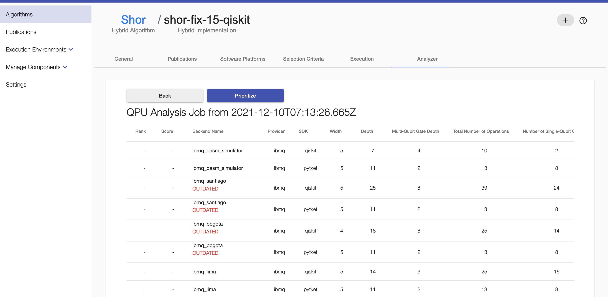
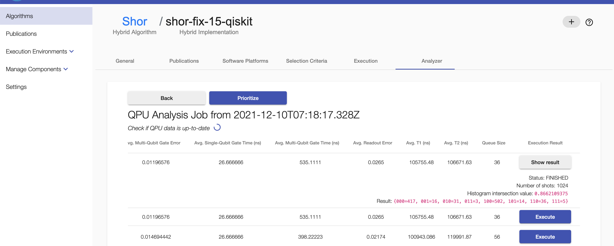
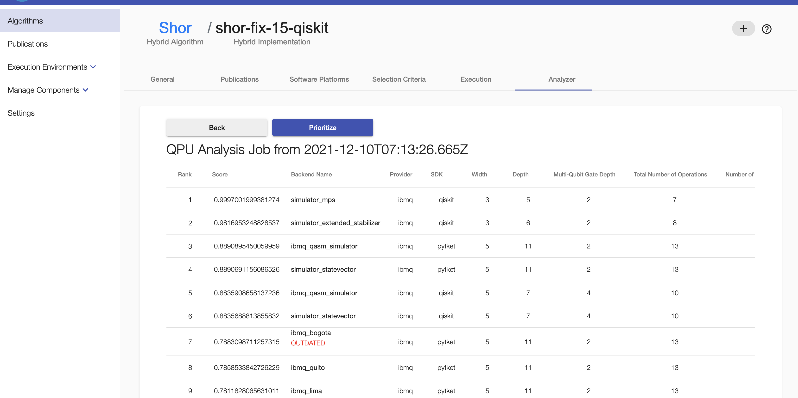

# Prioritization of Compiled Quantum Circuits

This guidance guides you through the process of compiling a quantum circuit on different quantum computers with several quantum compilers.  
  
All data of the case study are contained in [rankings-of-compiled-circuits.xml](./rankings-of-compiled-circuits.xlsx).

A demo video can be viewed [here](https://vimeo.com/656085309).

### Prerequisites
+ Docker Engine - [Install Guide](https://docs.docker.com/engine/install/)
+ Docker Compose - [Install Guide](https://docs.docker.com/compose/install/)
+ Clone this repository
+ Required ports are listed [here](./Docker/README.md)

### 1. Add Qiskit Credentials to docker-compose.override.yml
1. Copy the [_docker-compose.override.yml](./Docker/_docker-compose.override.yml) file in the Docker folder
to `docker-compose.override.yml`.
2. Insert your Qiskit token at `QPROV_IBMQ_TOKEN: 'your-qiskit-token-here'` in the `docker-compose.override.yml`.

**Note:** Currently only quantum computers of IBMQ are supported.

### 2. Run the UI and all required components
Open a console, navigate to the folder [Docker](./Docker), and run the following commands:

1. `docker-compose --profile nisqAnalyzerCompilerComparison pull`
2. `docker-compose build db`
3. `docker-compose --profile nisqAnalyzerCompilerComparison up`

After a few seconds, the ecosystem is up and running, and you can access it via the browser on <http://localhost:80>.
The UI is visible.

### 3. Application

1. In the UI, go to "Execution Environments" > "Software Platforms" and add "Qiskit" as a new SDK (button under "Search").
   
  
2. Go to "Algorithms" and add a new algorithm (button under "Search") by inserting a name and choosing its computation model.
   
  
3. In context of the algorithm, go to the "Implementations" tab > Add a new implementation to the algorithm by choosing a name for the circuit you want to compile.
   
  
4. In context of the implementation, go to the "Selecion Criteria" tab > insert the URL of the raw circuit, specifiy its SDK and select its language > save your adaptions.  
   **Note:** Sample circuits can be found under [Sample Circuits](./Sample%20Circuits).
   
  
5. Go to the "Analyzer" tab in context of the implementation > click "New Analysis", mark "Include Simulators", and insert you token of the Qiskit SDK.
The analysis is complete when the "Show analysis" button occurs.
   
  
6. Click on the "Show analysis" button to see suitable compiled circuits and their metric values for different quantum computers of several quantum compilers. 
To see all metric values scroll horizontally. It is automatically checked if the quantum computer metrics used for compilation are still up-to-date.
   
  
7. For executing a compiled circuit: click "Execute" > wait some time > click "Show result".
   
  
8. To prioritize the list of compiled circuits, click the "Prioritize" button, select the MCDA method to be applied and adapt, if needed, the importance points for the individual metrics, as described in the dialog > click "Ok".
   
  
9. When the prioritization process is finished, the rank and the score of each compiled circuit is presented.
   

### 4. Stop the environment

1. To stop the environment go to the console window with the docker-compose running, stop the process (e.g. control+shift+C for Mac).
2. To remove all volumes run `docker-compose down -v`.

## Haftungsausschluss

Dies ist ein Forschungsprototyp.
Die Haftung für entgangenen Gewinn, Produktionsausfall, Betriebsunterbrechung, entgangene Nutzungen, Verlust von Daten und Informationen, Finanzierungsaufwendungen sowie sonstige Vermögens- und Folgeschäden ist, außer in Fällen von grober Fahrlässigkeit, Vorsatz und Personenschäden, ausgeschlossen.

## Disclaimer of Warranty

Unless required by applicable law or agreed to in writing, Licensor provides the Work (and each Contributor provides its Contributions) on an "AS IS" BASIS, WITHOUT WARRANTIES OR CONDITIONS OF ANY KIND, either express or implied, including, without limitation, any warranties or conditions of TITLE, NON-INFRINGEMENT, MERCHANTABILITY, or FITNESS FOR A PARTICULAR PURPOSE.
You are solely responsible for determining the appropriateness of using or redistributing the Work and assume any risks associated with Your exercise of permissions under this License.

## License

SPDX-License-Identifier: Apache-2.0
